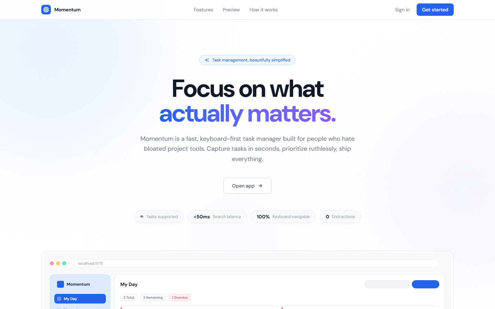

# Momentum

A fast, keyboard-first task manager built with React and Spring Boot. Capture tasks in seconds, prioritize ruthlessly, ship everything.



## Tech Stack

**Frontend** — React 18, Vite, Tailwind CSS, Framer Motion, React Query, Clerk  
**Backend** — Spring Boot 3, Java 21, Spring Security, JPA/Hibernate  
**Database** — PostgreSQL (Supabase)  
**Auth** — Clerk (JWT-based, per-user and org-scoped data)

## Features

- Grid and list views for tasks
- Priority levels (High / Medium / Low) with color-coded stripes
- Smart due date views — My Day, Upcoming, Important, Completed
- Instant client-side search
- Stats page with task analytics
- Organization switching via Clerk

## Getting Started

### Prerequisites

- Node.js 18+
- Java 21
- Maven

### Frontend

```bash
cd client
npm install
npm run dev
```

### Backend

```bash
cd server
./mvnw spring-boot:run
```

### Environment Variables

Create `client/.env`:

```env
VITE_CLERK_PUBLISHABLE_KEY=your_clerk_publishable_key
```

## Deployment

| Service | What it hosts |
| --- | --- |
| [Vercel](https://vercel.com) | Frontend (set root dir to `client`) |
| [Render](https://render.com) | Backend Spring Boot service |
| [Supabase](https://supabase.com) | PostgreSQL database |
| [Clerk](https://clerk.com) | Authentication |

## License

MIT
